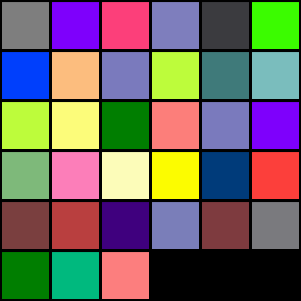

# QRgb

Generate more space efficient QR-codes that use colour to improve data density

# Example

Example of a QRgb encoded string of "I Like Broccoli, So Wery Very Much :)". Encoded at various bits per channels.

| 1 Bit | 2 Bit | 3 Bit |
| :-------------: |:-------------:|:-----:|
|       |  |  |
